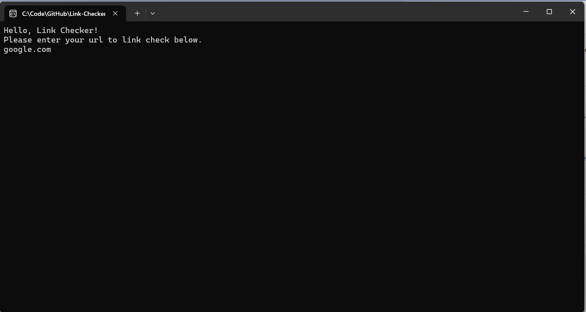

# Link Checker
A lightweight CLI utility written in C# that checks a web page for broken links.

## Features
- Detects broken links (403, 500 errors).
- Handles both absolute and relative URL's.
- Skips non-HTTP links (mailto, tel etc).
- Fast link checking using HTTP HEAD.

## Screenshots 

## To Run
After downloading the source code, then double click on the LinkChecker.ConsoleApp executable file in the bin directory.

## How It Works
- Fetches the HTML content of the given URL.
- Extracts all links located on the page.
- Converts relative URL's to absolute URL's.
- Checks each links HTTP status code
- Reports broken links (non-200 status codes)

## Limitations
- Does not handle JavaScript-rendered links.
- May miss some dynamically generated URL's.
- Rate limits are not implemented, so no large websites please.